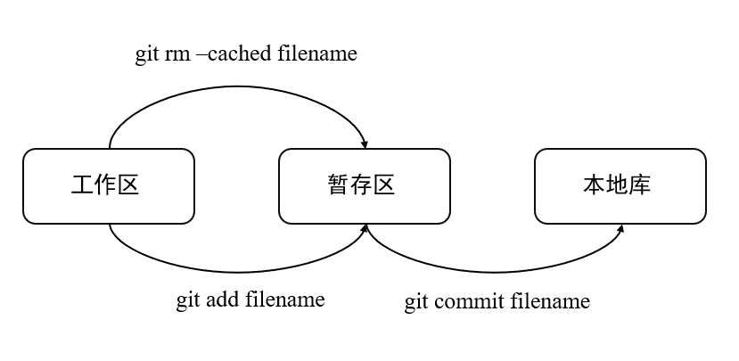
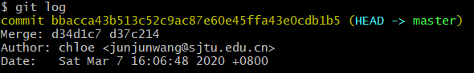
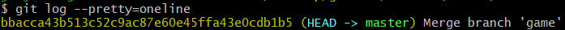
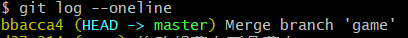
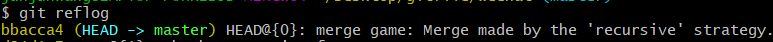
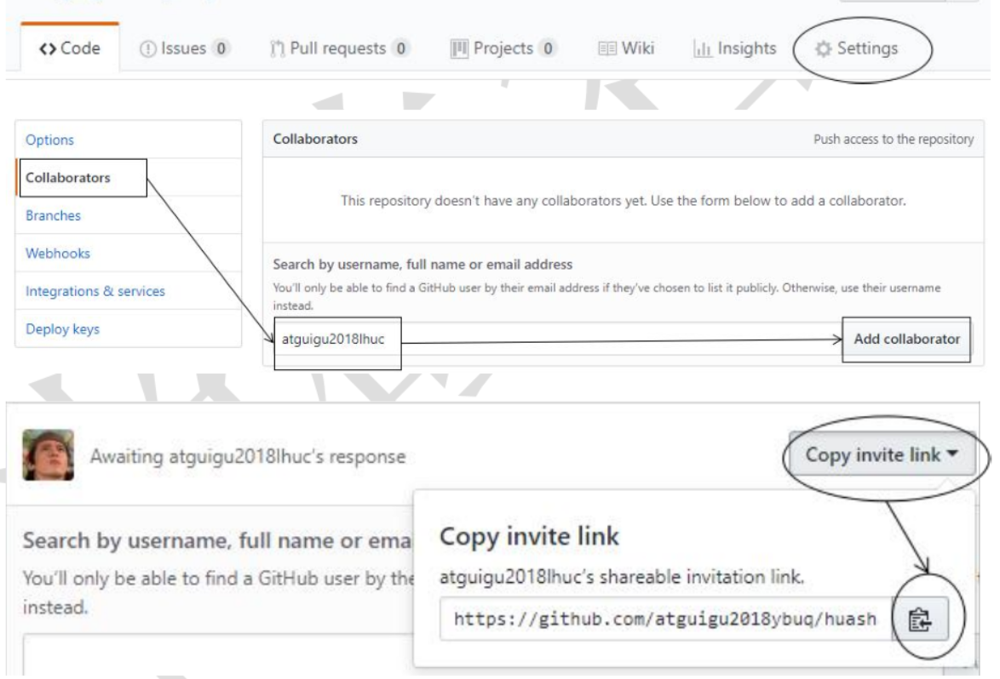

### 简单Linux命令

- 打开文件夹：cd directory
- 返回上一目录：cd ..
- 打开文件：cat filename.filetype
- 清屏：clear+Enter;  reset+Enter;  Ctrl+L
- 显示文件夹内容：ll 
- 显示文件夹隐藏内容：ll -lA
- 显示当前所在的位置：pwd

### Vim编辑器

i:进入编辑模式

esc:退出编辑模式

:set nu 显示行号

:wq 保存并退出

:q! 保存不退出

### Git的安装

* 需要安装到一个非中文无空格的目录
* 安装时直接选上是用Vim编辑器
* 完全不修改环境变量，仅在Git Bash中使用Git
* 其他均使用默认值

### Git的常用命令

1. **本地库的初始化**： git init

2. **设置签名**：用户名+Email地址

   **签名与登录远程库的用户名密码无关**

   签名分类：

   - 项目级别：在当前本地库中适用，保存于.git/config文件夹

     git config user.name XXX

     git config user.email YYY@KKK.com 

   - 系统级别：对当前系统的登录者有效，保存于~/config

     git config --global user.name XXX

     git config --global user.email YYY@KKK.com

   优先级：用户>系统，不允许二者均为空

3. **基本操作**

   

   * 查看状态：git status

   * 添加到暂存区：git add file name

   * 提交本地库：

      git commit file name（跳出vim，提示输入提交注释）

      git commit -m"commit message" file name                   

   * 查看历史记录

     git log

     

     git log --pretty=oneline

     

     git  log --oneline

     

     git reflog  

     

4. **在不同记录之间前进后退**

   * 本质是head指针的移动
   * 基于索引的操作：git reset --hard index
   * 基于^符号（只能后退，一个^就是一步）：git reset --hard^
   * 基于~符号（只能后退）：git reset --hard~n（后退n步）

5. **reset命令的参数对比**

   * --soft 仅移动本地库的指针
   * --mixed 移动本地库的指针，重置暂存区
   * --hard 移动本地库指针，重置暂存区和工作区

6. **删除文件的找回**（前提是这个文件依旧提交到的本地库）

   删除文件：git rm file name

   ​					git add file name

   ​					git commit -m"delete in local repository" file name

   找回：git reset --hard index

7. **比较文件差异**

   比较工作区与暂存区的文件：git diff file name

   比较本地库与暂存区的文件：git diff 版本号 文件名

### 分支管理

1. 概念：在版本控制中，使用多条线同时推进多个任务，每个分支独立进行，互不影响

   

2. 分支常用命令

   创建分支：git branch name1

   查看分支：git branch -v （*表示当然所在的分支）

   切换分支：git checkout name2

   合并分支：git merge name2（必须先回到待合并分支上，如主分支）

   合并时有冲突：修改了同一处后合并会出现冲突

   1. 编辑文件，修改到满意程度，保存
   2. git add filename
   3. git commit -m"message"（**后面没有文件名**）

### GitHub

1. 别名

   创建远程库的别名：git remote add alias remote_address  

   查看所有远程库别名：git remote -v 

2. 上传与下载：

   上传：git push alias branch_name（必须是团队成员）

   下载：git clone remote_file_address

   下载一个远程库同时会初始化远程地址别名，同时初始化本地库

3. 团队成员邀请

   

4. 拉去远程库

   - pull=fetch+merge

   - git fetch [远程库地址别名] [远程分支名]

     &emsp; fetch仅仅抓取远程文件，本地文件不发生改变，需要重新改变路径：git checkout alias/branch_name

   - git merge [远程库地址别名/远程分支名]

     &emsp;将远程库合并到本地

   - git pull [远程库地址别名] [远程分支名]

5. 跨团队协作
   - 对方fork
   - 对方clone
   - 修改
   - push远程
   - pull request给原公司
   - 原公司查看pull request，审核
   - 确认无误，merge pull request

   ###### 使用SSH免密登录

只能有一个默认的用户名和密码

ssh -keygen -t rsa -C github_email

进入.ssh目录，cat id_res.pub，复制，在github用户的SSH GPS中粘贴

   

   

   

   

   

   

   

   

   